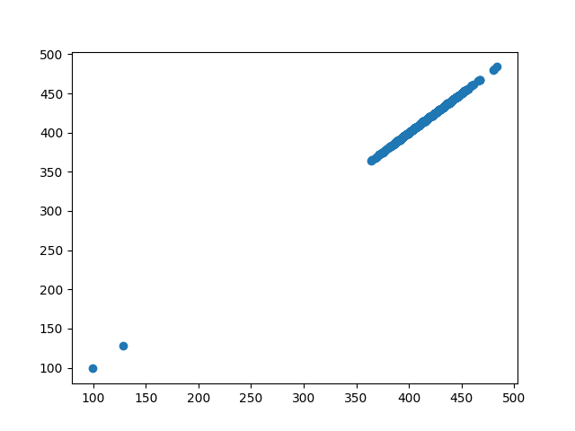
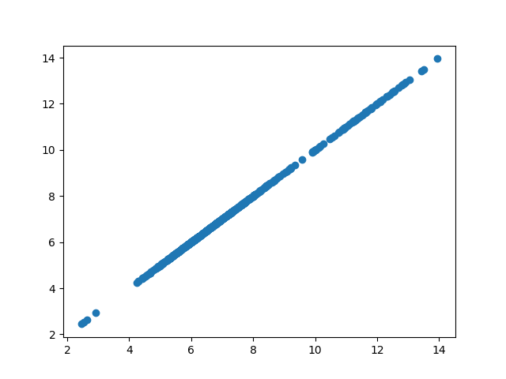

# Задание 2

В данном задании я разделил задачи на группы/типы, выставив оценки "сложности" от 1-5 для каждого задания. 
Оценки выставлялись следующим образом: все 5 асессоров решили задание - 1 балл, 4 - 2 и т.д.
Следующим шагом я решил избавиться от асессоров, которым приходило мало задач относительно других. 
Взглянув на график, было принято решение взять число в диапазоне от 150 - 350 и отсеять асессоры, которые решили меньше. 

Далее было посчитано корректность выполнения задачи для каждого пользователю по типа задачи 
и выставлена оценка следующим образом: 
сложность задачи определенного типа * правильный процент выполнения для этого типа, 
затем просуммировав значения по каждому типу задачи получили оценку для асессора. 

Оценив график была выявлена группа асессоров, который справились с заданием хуже всех
